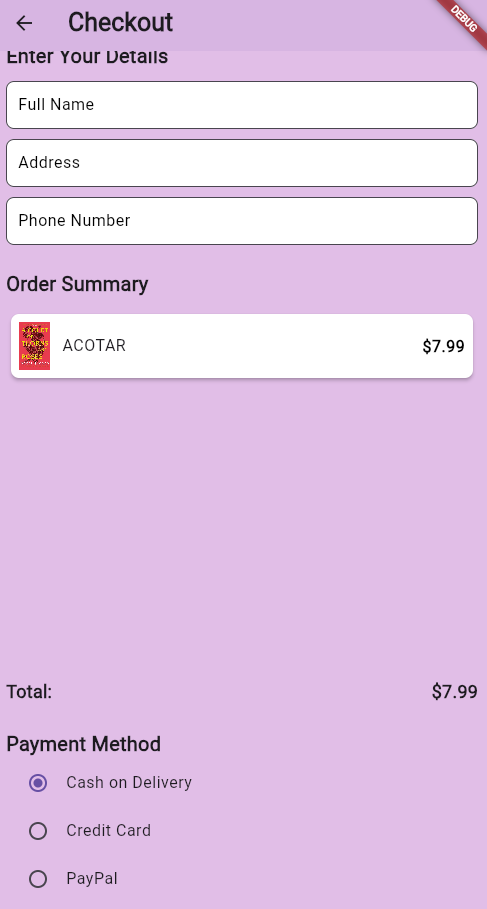

# Bookstore-App

A Flutter-based mobile bookstore app created for a Mobile Programming course.

## Features

- Login/Sign-up
- Product browsing (books)
- Add to cart
- Cart management
- Order Placement
- Wishlist

## Technologies Used

- Flutter (Dart)
- Material UI
- Local state management (e.g. setState or Provider)

## How to Run

1. Clone the repo
2. Run `flutter pub get` to fetch dependencies
3. Run the app on an emulator or physical device

## Screenshots

### Login Screen Design

### Forgot Password Screen Design

### Register Screen Design

### Home Screen Design

### Fantasy Book Category Screen Design

### Shop All Category Screen Design

### Book Description Screen Design

### Wishlist Screen Design

### Cart Screen Design

### Checkout/Cart Screen Design

### Confirm Order/Cart Screen Design

### Profile Screen Design

